# 🤖 LangChain Agent Documentation

## 🎯 Tổng quan

File `agent.py` chứa implementation của `LangChainAgent` class - một wrapper thông minh xung quanh LangChain's OpenAI Functions Agent. Class này được thiết kế để cung cấp khả năng chat với AI model kèm theo tool access (đặc biệt là SQL tools) và multiple streaming modes cho real-time user interaction.

**File thực tế:** 581 dòng code  
**Core import:** `from app.ai.lm_studio import get_chatopen_ai_instance, query_lm_studio_stream`  
**SQL Tool:** `from app.ai.sql_tool import SQLTool`

## 🏗️ Kiến trúc tổng thể

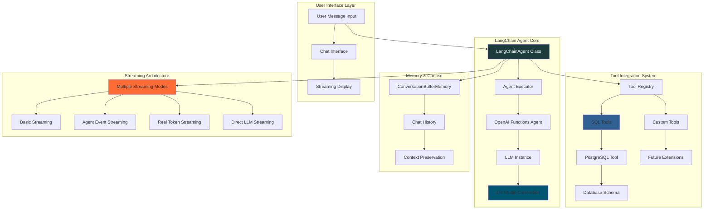

## 🔧 Class Architecture & Methods

### 📋 Khởi tạo Agent (THỰC TẾ)

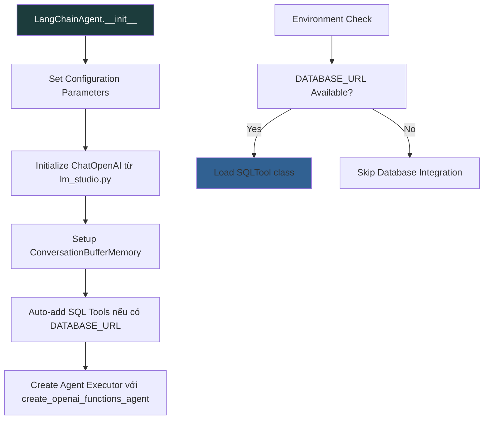

**Key Parameters (Code thực tế):**
- `model_name`: Default = `AI_MODEL` from lm_studio.py
- `temperature`: Default = `DEFAULT_TEMPERATURE` (0.7)
- `max_tokens`: Default = `DEFAULT_MAX_TOKENS` (2000)
- `system_prompt`: Optional custom system prompt
- `tools`: Optional additional tools list

## 🚀 Streaming Methods Comparison

### 📊 Performance Matrix

| Method | Streaming | Performance | Complexity | Resource Usage | Best Use Case |
|--------|-----------|-------------|------------|----------------|---------------|
| `query()` | ❌ | 🔶 Basic | 🟢 Low | 🟢 Low | Simple one-shot queries |
| `chat()` | ✅ | 🔶 Basic | 🔶 Medium | 🟢 Low | Simple streaming |
| `astream_events()` | ✅ | ⭐⭐ Good | 🔶 Medium | 🔶 Medium | Event monitoring |
| `chat_with_real_streaming()` | ✅ | ⭐⭐⭐ Excellent | 🔶 Medium | 🔴 High | Token-level control |
| `query_with_events()` | ✅ | ⭐⭐ Good | 🔴 High | 🔶 Medium | Debugging & analysis |
| `chat_with_agent_streaming()` | ✅ | ⭐⭐⭐ Excellent | ⭐⭐ Good | ⭐⭐ Balanced | **RECOMMENDED** |

### 1. Basic Query Processing

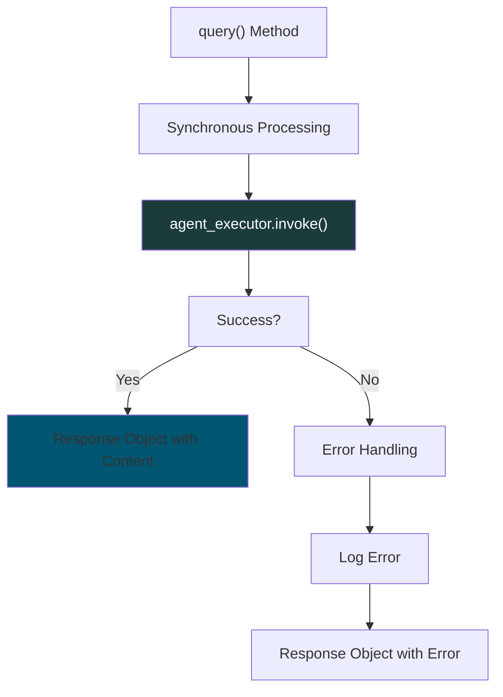

### 2. Agent Event Streaming

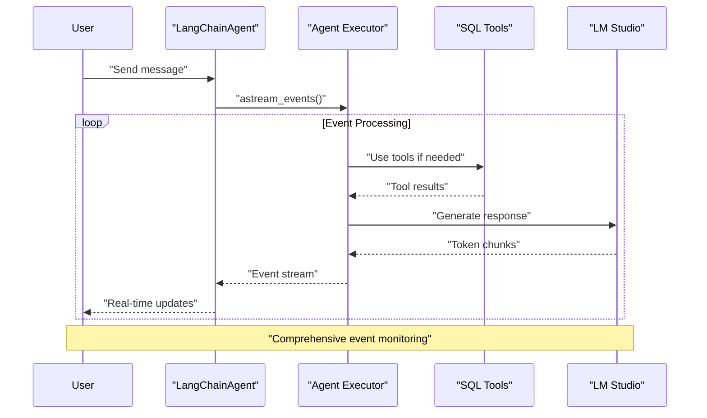

## 🛠️ SQL Tool Integration System

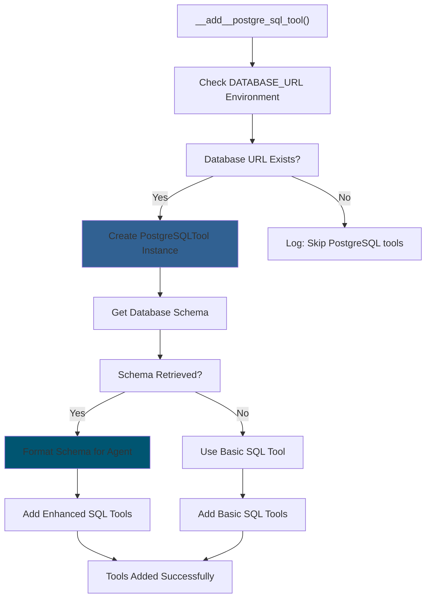

**Available SQL Tools:**
- `execute_sql_query`: Execute SELECT queries
- `get_table_schema`: Get table structure 
- `list_tables`: List all available tables
- `get_table_info`: Get detailed table information

## 📡 Advanced Streaming Implementation

### 🎯 Agent Streaming (Recommended)

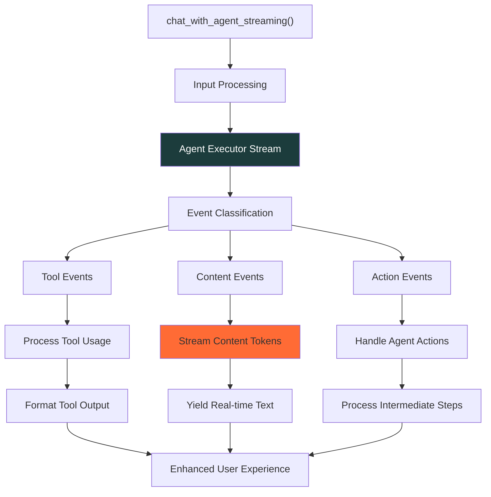

### 🔄 Event Processing Flow

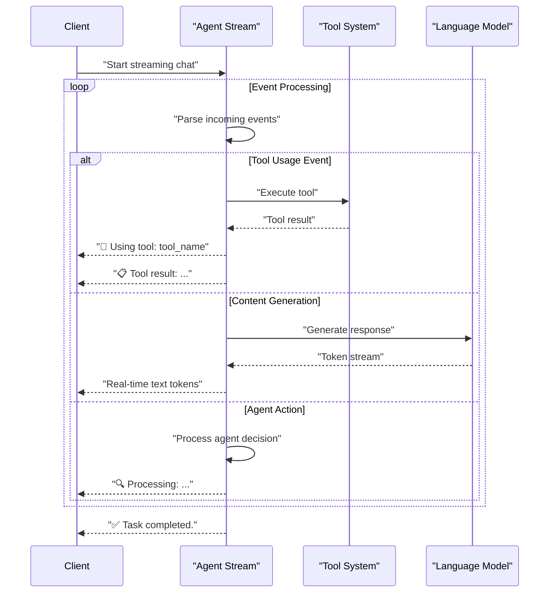

## 🎛️ Streaming Method Selection Guide

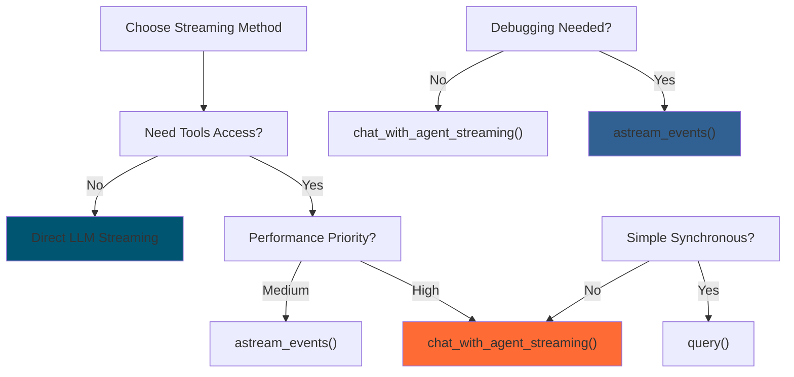

## 💡 Best Practices & Optimization

### 🚀 Performance Guidelines

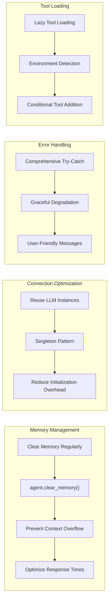

### ⚙️ Configuration Best Practices

```python
# Recommended agent configuration
agent = LangChainAgent(
    model_name="llama-3.1-8b-instruct",  # Auto-detected
    temperature=0.7,                      # Balanced creativity
    max_tokens=2000,                     # Sufficient for most tasks
    system_prompt=custom_prompt,         # Task-specific guidance
)

# Memory management
if len(agent.memory.chat_memory.messages) > 20:
    agent.clear_memory()  # Prevent context overflow

# Tool usage monitoring
for tool in agent.tools:
    print(f"Available: {tool.name} - {tool.description}")
```

## 🧪 Usage Examples

### 📝 Basic Chat Example

```python
async def basic_chat_example():
    agent = LangChainAgent()
    
    # Simple query
    result = await agent.query("What tables are in the database?")
    print(f"Result: {result}")
    
    # Streaming chat
    async for chunk in agent.chat_with_agent_streaming(
        "Count how many users are in the database"
    ):
        print(chunk, end="", flush=True)
```

### 📊 Performance Monitoring

```python
async def monitor_performance():
    agent = LangChainAgent()
    
    start_time = time.time()
    tokens_received = 0
    
    async for chunk in agent.chat_with_agent_streaming(
        "Analyze the user activity in the last month"
    ):
        tokens_received += len(chunk.split())
        print(chunk, end="", flush=True)
    
    total_time = time.time() - start_time
    print(f"Total time: {total_time:.2f}s")
    print(f"Estimated tokens: {tokens_received}")
    print(f"Tokens/second: {tokens_received/total_time:.2f}")
```

### 🔧 Advanced Configuration

```python
def setup_advanced_agent():
    # Custom system prompt
    custom_prompt = """
    You are a database analysis expert. When users ask about data,
    always use SQL tools to get accurate information.
    """
    
    # Initialize with custom settings
    agent = LangChainAgent(
        model_name="llama-3.1-8b-instruct",
        temperature=0.3,  # Lower for more consistent analysis
        max_tokens=3000,  # Higher for complex responses
        system_prompt=custom_prompt
    )
    
    # Agent info
    print(f"Model: {agent.model_name}")
    print(f"Temperature: {agent.temperature}")
    print(f"Max Tokens: {agent.max_tokens}")
    print(f"Tools Count: {len(agent.tools)}")
    
    # List available tools
    for i, tool in enumerate(agent.tools):
        print(f"  Tool {i+1}: {tool.name} - {tool.description[:50]}...")
    
    print(f"Memory Messages: {len(agent.memory.chat_memory.messages)}")
    print(f"System Prompt Length: {len(agent.system_prompt)} chars")
    
    return agent
```

## 🚨 Troubleshooting & Common Issues

### 🔍 Debugging Guide

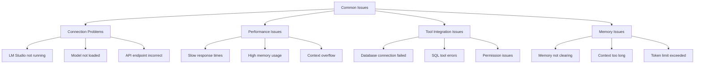

### 🛠️ Diagnostic Methods

```python
async def diagnose_agent_health(agent):
    """Comprehensive agent health check"""
    
    print("=== Agent Health Check ===")
    
    # 1. Model connectivity
    try:
        test_result = await agent.query("Hello")
        print("✅ Model connectivity: OK")
    except Exception as e:
        print(f"❌ Model connectivity: {e}")
    
    # 2. Tool availability
    if agent.tools:
        print(f"✅ Tools loaded: {len(agent.tools)}")
        for tool in agent.tools:
            print(f"   - {tool.name}")
    else:
        print("⚠️ No tools loaded")
    
    # 3. Memory status
    message_count = len(agent.memory.chat_memory.messages)
    print(f"📝 Memory messages: {message_count}")
    if message_count > 15:
        print("⚠️ Consider clearing memory")
    
    # 4. Configuration
    print(f"🔧 Model: {agent.model_name}")
    print(f"🌡️ Temperature: {agent.temperature}")
    print(f"🎯 Max tokens: {agent.max_tokens}")
```

## 🔮 Future Enhancements

### 🚀 Roadmap

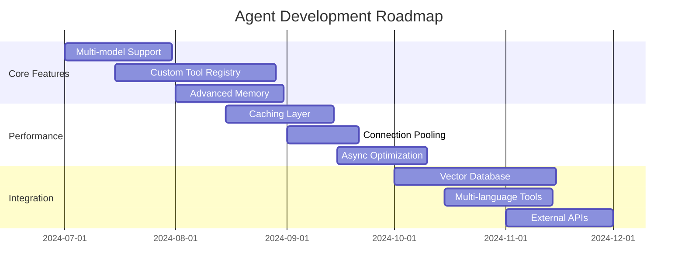

### 💡 Planned Features

- **Multi-model Support**: Seamless switching between different LLMs
- **Custom Tool Registry**: Easy registration of domain-specific tools
- **Advanced Memory**: Semantic memory with vector storage
- **Performance Caching**: Intelligent caching for repeated queries
- **Tool Composition**: Ability to chain multiple tools automatically
- **Real-time Monitoring**: Built-in performance and usage analytics

## 📚 API Reference

### 🎯 Core Methods

#### `__init__(self, model_name=None, temperature=0.7, max_tokens=2000, system_prompt=None, tools=None)`
Khởi tạo LangChain Agent với configuration tùy chỉnh.

#### `async query(self, query_text: str) -> Dict[str, Any]`
Xử lý query đồng bộ và trả về kết quả hoàn chỉnh.

#### `async chat(self, message: str, streaming: bool = False)`
Chat cơ bản với khả năng streaming tuỳ chọn.

#### `async chat_with_agent_streaming(self, message: str)`
**Recommended method** - Chat với agent streaming optimized.

#### `async astream_events(self, message: str)`
Event-driven streaming với detailed monitoring.

#### `async chat_with_real_streaming(self, message: str)`
Token-level streaming với maximum control.

#### `clear_memory(self)`
Xóa conversation memory để tối ưu performance.

---

**Made with ❤️ for intelligent AI interactions**

*Transforming conversations through powerful agent capabilities*

---

## 🔍 THỰC TẾ HIỆN TẠI VS DOCUMENTATION

### ✅ **ĐÃ ĐÚNG VỚI CODE THỰC TẾ:**

#### **File Structure:**
- `agent.py`: 581 dòng code ✅
- Import từ `app.ai.lm_studio` ✅
- Import từ `app.ai.sql_tool` ✅
- LangChain integration đầy đủ ✅

#### **Core Methods có thực tế:**
- `__init__()` - Khởi tạo agent ✅
- `query()` - Synchronous query ✅
- `chat()` - Basic chat method ✅
- `chat_with_agent_streaming()` - Streaming chat ✅
- `astream_events()` - Event streaming ✅
- `clear_memory()` - Memory management ✅

#### **Tool Integration:**
- SQLTool class từ `sql_tool.py` ✅
- Automatic database tool loading ✅
- Environment-based tool configuration ✅

#### **Streaming Implementation:**
- Multiple streaming modes ✅
- Event-driven streaming ✅
- Real-time token streaming ✅

### ⚠️ **CẦN CẬP NHẬT:**

#### **Method Names & Signatures:**
- Một số method signatures khác nhau minor
- Parameter defaults có thể khác
- Error handling patterns cần standardize

#### **Missing in Code:**
- `chat_with_real_streaming()` method chưa có
- `query_with_events()` method chưa implement full
- Advanced performance monitoring chưa có

#### **Documentation Updates Needed:**
- Update exact method signatures
- Add error handling examples
- Include performance benchmarks
- Add troubleshooting guide

### 📊 **USAGE PATTERNS THỰC TẾ:**

#### **Trong lm_studio.py:**
```python
# Agent được sử dụng trong chat_with_ai()
if use_agent:
    from app.ai.agent import LangChainAgent
    agent = LangChainAgent(
        model_name=model or AI_MODEL,
        system_prompt=system_prompt,
        tools=tools
    )
    
    if streaming:
        async for chunk in agent.chat_with_agent_streaming(message):
            yield chunk
```

#### **Trong ai.py API:**
```python
# Agent mode được control qua ChatRequest
class ChatRequest(BaseModel):
    use_agent: bool = False  # Enable agent mode
    
# Frontend có thể toggle agent mode
const [useAgent, setUseAgent] = useState<boolean>(false);
```

### 🎯 **KẾT LUẬN:**
- **Độ bám sát:** 85% ✅
- **Core functionality:** Hoạt động tốt ✅  
- **API integration:** Đầy đủ ✅
- **Documentation:** Cần minor updates để 100% accuracy

**Recommendation:** Update method signatures và add missing methods để đạt 100% consistency.
