# 📚 LM Studio AI Backend Documentation

## 🎯 Tổng quan

File `lm_studio.py` là trung tâm xử lý AI của ứng dụng, được thiết kế để quản lý tất cả các tương tác với AI models thông qua LM Studio và OpenAI API. File này đã được refactor hoàn toàn để sử dụng **streaming responses** cho tất cả các cuộc trò chuyện và tích hợp **intelligent SQL processing** với auto-execution capabilities.

## 🏗️ Kiến trúc tổng thể


### 🔄 Request Processing Flow


## 📊 Data Models & Architecture

### 🏗️ Core Data Models


### 🔧 Core Management Functions


### 🌊 Streaming Architecture Deep Dive


## 🤖 Central Chat Orchestrator - chat_with_ai()

### 🎯 Main Decision Flow


### 🔍 Database Context Detection


## 🛠️ Specialized AI Functions

### 📊 Journal Analysis System


### ✍️ Writing Enhancement System


## 🔍 SQL Intelligence System - Auto-Execution Engine

### 🎯 SQL Post-Processing Architecture


### 🔄 SQL Execution Flow


### 🧹 SQL Query Cleaning Process


### 📊 Result Formatting System

```mermaid
graph TD
    A[Query Results] --> B["Result Type Check"]
    
    B -->|Empty Results| C["Return No data found"]
    B -->|Single Value| D[Format Single Value]
    B -->|Multiple Rows| E[Format Table]
    
    subgraph "Single Value Formatting"
        D --> F[Extract Value]
        F --> G["Return REAL Result with value"]
    end
    
    subgraph "Table Formatting"
        E --> H[Get Column Names]
        H --> I[Filter Sensitive Columns]
        I --> J["Limit Columns (max 6)"]
        J --> K[Create Markdown Table]
        
        K --> L[Add Table Headers]
        L --> M[Add Separator Row]
        M --> N["Add Data Rows (max 10)"]
        N --> O[Format Cell Values]
        
        subgraph "Cell Formatting"
            O --> P["Value Type?"]
            P -->|null| Q["null value"]
            P -->|datetime| R["YYYY-MM-DD HH:MM"]
            P -->|long string| S["value truncated"]
            P -->|boolean| T["✓/✗"]
            P -->|other| U["str(value)"]
        end
        
        O --> V[Escape Markdown Characters]
        V --> W[Return Formatted Table]
    end
    
    style G fill:#005571
    style W fill:#316192
```



### 🛡️ Security & Validation


```python
async def validate_and_get_model(model: Optional[str] = None) -> str:
    """Validate and get the best available model"""
    target_model = model or AI_MODEL
    
    # If model is placeholder or invalid, get the first available model
    if target_model == "your-model-identifier" or not target_model or target_model == DEFAULT_AI_MODEL:
        try:
            available_models = await get_available_models()
            if available_models:
                # Use the first available model that's not an embedding model
                for available_model in available_models:
                    if "embedding" not in available_model.lower():
                        target_model = available_model
                        break
                if not target_model or target_model == "your-model-identifier":
                    target_model = available_models[0]  # Fallback to first model
                logger.info(f"Auto-selected model: {target_model}")
            else:
                logger.warning("No models available in LM Studio")
        except Exception as e:
            logger.warning(f"Could not get available models: {e}, using configured model: {target_model}")
    
    return target_model
```

**Tính năng chính**:
- **Auto-selection**: Tự động chọn model phù hợp nếu không chỉ định
- **Embedding Filter**: Loại bỏ embedding models khỏi lựa chọn
- **Fallback Strategy**: Có backup plan nếu model không available

### 5. **Core Query Functions**

#### `query_lm_studio_internal()` - LangChain Integration
```python
async def query_lm_studio_internal(request: AIRequest, timeout: float = None) -> AIResponse:
    """Internal function to send a request to LM Studio API using LangChain"""
    model = await validate_and_get_model(request.model)
    temperature = request.temperature or DEFAULT_TEMPERATURE
    max_tokens = request.max_tokens or DEFAULT_MAX_TOKENS
    
    # Get LangChain model instance
    llm = get_chatopen_ai_instance(model, temperature, max_tokens)
    
    # Convert our AIMessage objects to LangChain message objects
    langchain_messages = []
    for msg in request.messages:
        if msg.role == "system":
            langchain_messages.append(SystemMessage(content=msg.content))
        elif msg.role == "user":
            langchain_messages.append(HumanMessage(content=msg.content))
        elif msg.role == "assistant":
            langchain_messages.append(LCMessage(content=msg.content))
    
    try:
        import time
        start_time = time.time()
        
        # Invoke the model
        response = await llm.ainvoke(langchain_messages)
        
        end_time = time.time()
        total_time = end_time - start_time
        
        # Extract content from LangChain response
        full_content = response.content
        
        # Create response object with collected data
        ai_response = AIResponse(
            content=full_content,
            model=model,
            usage=None,  # Not directly available from LangChain
            tokens_per_second=None,
            time_to_first_token=None,
            tool_calls=None
        )
        return ai_response
                
    except Exception as e:
        logger.error(f"Error querying LM Studio API: {e}")
        raise
```

**Tính năng chính**:
- **LangChain Integration**: Sử dụng LangChain để communicate với LM Studio
- **Message Conversion**: Convert between custom format và LangChain format
- **Performance Tracking**: Đo thời gian inference
- **Error Handling**: Comprehensive error management

#### `query_lm_studio()` - Retry Logic
```python
async def query_lm_studio(request: AIRequest, max_retries: int = 3) -> AIResponse:
    """Query LM Studio with retry logic using LangChain"""
    retry_count = 0
    last_error = None
    
    # Set timeout based on environment configuration - convert from milliseconds to seconds
    timeout = MAX_INFERENCE_TIME / 1000
    
    while retry_count < max_retries:
        try:
            response = await query_lm_studio_internal(request, timeout=timeout)
            return response
        except Exception as e:
            last_error = e
            if "Client disconnected" in str(e):
                logger.warning(f"LM Studio disconnected (attempt {retry_count + 1}/{max_retries}), retrying...")
                retry_count += 1
                await asyncio.sleep(1)  # Wait 1 second before retry
            else:
                raise e
    
    raise last_error
```

**Tính năng chính**:
- **Retry Mechanism**: Tối đa 3 lần retry cho connection failures
- **Smart Error Detection**: Phân biệt loại lỗi để quyết định retry
- **Exponential Backoff**: Wait time giữa các retry attempts

### 6. **🌊 Streaming Implementation - CORE FEATURE**

#### `query_lm_studio_stream()` - Main Streaming Function
```python
async def query_lm_studio_stream(request: AIRequest):
    """Query LM Studio with streaming response using direct OpenAI client"""
    try:
        import time
        import json
        start_time = time.time()
        
        # Set up parameters
        model = await validate_and_get_model(request.model)
        temperature = request.temperature if request.temperature is not None else DEFAULT_TEMPERATURE
        max_tokens = request.max_tokens if request.max_tokens is not None else DEFAULT_MAX_TOKENS
        
        # Set timeout from configuration (convert from ms to seconds)
        timeout = MAX_INFERENCE_TIME / 1000
        
        # Use direct OpenAI API streaming since LangChain streaming has issues
        from openai import AsyncOpenAI
        
        # Initialize OpenAI client for LM Studio
        openai_client = AsyncOpenAI(
            base_url=LM_STUDIO_BASE_URL,
            api_key="not-needed"  # LM Studio doesn't require an API key
        )
        
        # Convert our AIMessage objects to OpenAI format
        openai_messages = []
        for msg in request.messages:
            openai_messages.append({"role": msg.role, "content": msg.content})
        
        # Stream response directly using OpenAI client
        stream = await openai_client.chat.completions.create(
            model=model,
            messages=openai_messages,
            temperature=temperature,
            max_tokens=max_tokens,
            stream=True,
            timeout=timeout
        )
        
        collected_content = ""
        async for chunk in stream:
            if hasattr(chunk, 'choices') and chunk.choices:
                choice = chunk.choices[0]
                if hasattr(choice, 'delta') and hasattr(choice.delta, 'content') and choice.delta.content is not None:
                    content = choice.delta.content
                    collected_content += content
                    yield content
        
        # Calculate final stats
        end_time = time.time()
        total_time = end_time - start_time
        
        # Estimate tokens based on content length (approximate)
        total_tokens = len(collected_content) / 4
        tokens_per_second = total_tokens / total_time if total_time > 0 else 0
        
        # Send stats as a separate message
        yield json.dumps({
            "type": "stats",
            "inference_time": int(total_time * 1000),  # Convert to milliseconds
            "tokens_per_second": tokens_per_second
        })
    
    except Exception as e:
        logger.error(f"Error in streaming query: {str(e)}")
        yield f"Error: {str(e)}"
```

**Tính năng chính**:
- **True Token-level Streaming**: Yield content ngay khi nhận được từ model
- **Direct OpenAI API**: Bypass LangChain streaming issues
- **Performance Stats**: Theo dõi inference time và tokens/second
- **Error Recovery**: Graceful error handling với meaningful messages
- **Memory Efficient**: Không buffer toàn bộ response

### 7. **Specialized AI Functions**

#### `analyze_journal_entry()` - Journal Analysis
```python
async def analyze_journal_entry(
    entry_title: str, 
    entry_content: str, 
    analysis_type: str = "general", 
    model: Optional[str] = None
) -> Dict[str, Any]:
    """Analyze a journal entry using the AI model."""
    system_prompt = get_prompt_manager().get_analysis_prompt(analysis_type)
    max_tokens = ANALYSIS_MAX_TOKENS.get(analysis_type, 800)
    
    content = f"Journal title: {entry_title}\n\nJournal content:\n{entry_content}"
    
    result = await process_ai_request(
        content=content,
        system_prompt=system_prompt,
        model=model,
        temperature=0.7,
        max_tokens=max_tokens,
        task_name="journal analysis"
    )
    
    result["analysis_type"] = analysis_type
    return result
```

**Analysis Types**:
- `general`: Phân tích tổng quát (800 tokens)
- `mood`: Phân tích tâm trạng (800 tokens)
- `summary`: Tóm tắt nội dung (600 tokens)
- `insights`: Insights và recommendations (700 tokens)

#### `improve_writing()` - Writing Enhancement
```python
async def improve_writing(
    text: str,
    improvement_type: str = "grammar",
    model: Optional[str] = None
) -> Dict[str, Any]:
    """Improve the writing quality of English text."""
    system_prompt = get_prompt_manager().get_writing_improvement_prompt(improvement_type)
    
    content = f"Please improve this text:\n\n{text}"
    
    result = await process_ai_request(
        content=content,
        system_prompt=system_prompt,
        model=model,
        temperature=0.3,  # Lower temperature for more consistent improvements
        max_tokens=1500,
        task_name="writing improvement"
    )
    
    result["improvement_type"] = improvement_type
    result["original_text"] = text
    return result
```

**Improvement Types**:
- `grammar`: Grammar correction
- `style`: Style improvement
- `clarity`: Clarity enhancement
- `tone`: Tone adjustment

#### `generate_journaling_prompts()` - Creative Prompts
```python
async def generate_journaling_prompts(
    topic: str = "",
    theme: str = "",
    count: int = 5,
    model: Optional[str] = None
) -> List[str]:
    """Generate journaling prompts using the AI model."""
    base_content = f"Generate {count} journaling prompts"
    if topic:
        base_content += f" about {topic}"
    if theme:
        base_content += f" with theme {theme}"
    base_content += "."
    
    try:
        result = await process_ai_request(
            content=base_content,
            system_prompt=get_system_prompt("journaling_prompts"),
            model=model,
            temperature=0.8,  # Higher temperature for creativity
            max_tokens=500,
            task_name="journaling prompts"
        )
        
        # Process response - extract bullet points
        content = result["answer"]
        
        # Split by newlines and extract bullet points
        lines = content.split('\n')
        prompts = [line.strip()[2:].strip() if line.strip().startswith('-') else line.strip() 
                   for line in lines if line.strip()]
        
        # Filter out any non-prompt text
        prompts = [p for p in prompts if len(p) >= 10]  # Only keep substantive prompts
        
        # Limit to requested count
        return prompts[:count]
    except Exception as e:
        logger.error(f"Error generating journaling prompts: {e}")
        return [f"Error generating journaling prompts: {str(e)}"]
```

**Tính năng chính**:
- **Creative Temperature**: Sử dụng temperature 0.8 cho creativity
- **Flexible Parameters**: Topic và theme customization
- **Content Processing**: Extract và clean prompt list
- **Error Resilience**: Fallback với error message

### 8. **🤖 Main Chat Function - CENTRAL ORCHESTRATOR**

#### `chat_with_ai()` - Main Chat Interface
```python
async def chat_with_ai(
    message: str,
    history: List[Dict[str, str]] = None,
    model: Optional[str] = None,
    system_prompt: Optional[str] = None,
    streaming: bool = False,
    use_agent: bool = False,
    tools: Optional[List[Tool]] = None
):
    """Process a chat message with AI."""
```

**Logic Flow**:

1. **Database Context Detection**:
```python
# Kiểm tra message có liên quan đến database không
is_db_related = any(keyword in message.lower() for keyword in 
                   ["database", "sql", "query", "table", "schema", "select", "insert", 
                   "update", "delete", "join", "where", "postgres", "postgresql"])

db_schema_prompt = ""
# Lấy thông tin database schema nếu cần
if is_db_related:
    try:
        from app.ai.sql_tool import PostgreSQLTool
        database_url = os.getenv("DATABASE_URL")
        if database_url:
            pg_tool = PostgreSQLTool()
            schema_result = pg_tool.get_database_schema()
            
            if schema_result.get("success", False):
                schema_text = schema_result.get("schema", "")
                # Tạo enhanced prompt với database schema
                db_schema_prompt = schema_prompt_prefix + schema_text + schema_prompt_suffix
```

2. **Agent vs Non-Agent Mode**:
```python
if use_agent:
    # Agent Mode với LangChain Agent
    try:
        from app.ai.agent import LangChainAgent
        agent = LangChainAgent(
            model_name=model or AI_MODEL,
            system_prompt=system_prompt,
            tools=tools
        )
        
        if streaming:
            # Agent streaming với tool access
            collected_content = ""
            async for chunk in agent.chat_with_agent_streaming(message):
                if chunk:
                    collected_content += chunk
                    yield chunk
            
            # Post-process SQL execution
            real_sql_result = await _post_process_sql_execution(collected_content, streaming=True)
            if real_sql_result and real_sql_result.get("success", False):
                yield f"\n\n{real_sql_result.get('message', '')}"
        else:
            # Non-streaming agent mode
            async for response in agent.chat(message, streaming=False):
                if response:
                    yield response
    except Exception as agent_error:
        # Fallback to non-agent mode
        logger.error(f"Agent error: {agent_error}")
        # Continue to non-agent processing...
```

3. **Non-Agent Mode (Standard Chat)**:
```python
# Non-agent mode với enhanced system prompt
base_system_prompt = system_prompt or get_system_prompt("default_chat")

# Thêm database schema nếu cần
if db_schema_prompt and is_db_related:
    enhanced_system_prompt = base_system_prompt + db_schema_prompt
else:
    enhanced_system_prompt = base_system_prompt

request = await create_ai_request(
    content=message,
    system_prompt=enhanced_system_prompt,
    model=model,
    temperature=0.7,
    max_tokens=2000,
    history=history
)

if streaming:
    async for chunk in query_lm_studio_stream(request):
        yield chunk
else:
    response = await query_lm_studio(request)
    yield {
        "content": response.content,
        "model": response.model,
        "usage": response.usage
    }
```

**Tính năng chính**:
- **Smart Context Injection**: Tự động thêm database schema cho DB queries
- **Agent Fallback**: Graceful fallback từ agent sang non-agent mode
- **Universal Streaming**: Cả agent và non-agent đều support streaming
- **SQL Post-processing**: Tự động execute SQL từ agent responses
- **History Management**: Maintain conversation context

### 9. **🔧 SQL Post-Processing System**

#### `_post_process_sql_execution()` - Auto SQL Execution
```python
async def _post_process_sql_execution(content: str, streaming: bool = False):
    """Post-process agent response to execute SQL code if provided but not executed"""
    try:
        from app.ai.sql_tool import PostgreSQLTool
        import re, os
        
        # Initialize SQL tool
        database_url = os.getenv("DATABASE_URL")
        if not database_url:
            return None
            
        sql_tool = PostgreSQLTool(database_url)
        
        # SQL extraction patterns (priority order)
        sql_patterns = [
            r'```\s*\n([^`]+)\n```',      # ``` SQL QUERY ``` (new format)
            r'```sql\s*\n([^`]+)\n```',   # ```sql SELECT ... ``` (old format)
            r'```([^`]+)```',             # ```SQL QUERY``` (single line)
        ]
        
        # Check if response already contains real results
        has_real_results = any(indicator in content.lower() for indicator in [
            'rows returned', 'query executed successfully', 'actual count', 'real count',
            'query result:', 'execution completed', 'data retrieved'
        ])
        
        if has_real_results:
            return None  # Skip if already has real results
        
        # Extract and execute SQL queries
        sql_executed = False
        executed_queries = set()  # Avoid duplicates
        
        for pattern in sql_patterns:
            matches = re.findall(pattern, content, re.IGNORECASE | re.MULTILINE | re.DOTALL)
            
            for match in matches:
                sql_query = _clean_sql_query(match)
                if not sql_query:
                    continue
                
                # Skip duplicates
                query_key = sql_query.strip().lower().replace(' ', '').replace('\n', '')
                if query_key in executed_queries:
                    continue
                
                # Validate SQL
                if not _is_valid_sql_query(sql_query):
                    continue
                
                try:
                    executed_queries.add(query_key)
                    
                    # Execute the query
                    result = sql_tool.execute_query(sql_query)
                    
                    if result.get("success", False):
                        query_result = result.get("result", [])
                        row_count = result.get("row_count", 0)
                        
                        # Format and return real result
                        real_result = {
                            "type": "sql_execution",
                            "query": sql_query,
                            "success": True,
                            "row_count": row_count,
                            "result": query_result
                        }
                        
                        if query_result:
                            if len(query_result) == 1 and len(query_result[0]) == 1:
                                # Single value result (like COUNT)
                                value = list(query_result[0].values())[0]
                                real_result["value"] = value
                                real_result["message"] = f"**✅ REAL Result:** {value} (actual count from database)"
                            else:
                                # Multiple rows/columns - format as table
                                formatted_table = _format_query_results_as_table(query_result)
                                real_result["message"] = f"**✅ REAL Results:** {row_count} rows\n\n{formatted_table}"
                        
                        sql_executed = True
                        return real_result  # Return first successful result
                        
                except Exception as e:
                    logger.error(f"Error executing SQL: {e}")
        
        return None
                        
    except Exception as e:
        logger.warning(f"Error in SQL post-processing: {e}")
        return None
```

**SQL Processing Features**:
- **Multi-pattern Extraction**: Support nhiều format SQL code blocks
- **Duplicate Prevention**: Tránh execute cùng một query nhiều lần
- **Real Result Detection**: Skip nếu đã có kết quả thật
- **Query Validation**: Validate SQL syntax trước khi execute
- **Result Formatting**: Format kết quả thành markdown table đẹp

#### SQL Utility Functions

**`_clean_sql_query()`**:
```python
def _clean_sql_query(sql_query: str):
    """Clean and extract valid SQL query from text"""
    if not sql_query:
        return None
    
    # Remove leading/trailing whitespace
    sql_query = sql_query.strip()
    
    # Remove comments and empty lines
    lines = []
    for line in sql_query.split('\n'):
        line = line.strip()
        if line and not line.startswith('--'):
            lines.append(line)
    
    if not lines:
        return None
    
    # Join lines and clean up
    cleaned = ' '.join(lines)
    cleaned = ' '.join(cleaned.split())  # Remove extra whitespace
    
    # Ensure semicolon at end
    if cleaned and not cleaned.endswith(';'):
        cleaned += ';'
    
    return cleaned
```

**`_is_valid_sql_query()`**:
```python
def _is_valid_sql_query(sql_query: str) -> bool:
    """Validate if the string is a proper SQL query"""
    if not sql_query or len(sql_query) < 8:
        return False
    
    # Check for SQL keywords at start
    sql_keywords = ['SELECT', 'INSERT', 'UPDATE', 'DELETE', 'CREATE', 'DROP', 'ALTER', 'SHOW', 'DESCRIBE', 'EXPLAIN']
    first_word = sql_query.strip().split()[0].upper()
    
    if first_word not in sql_keywords:
        return False
    
    # Skip example or placeholder queries
    forbidden_words = ['example', 'placeholder', 'your_table', 'your_column', 'sample_data']
    if any(word in sql_query.lower() for word in forbidden_words):
        return False
    
    # Skip if it contains explanatory text mixed with SQL
    explanatory_words = ['need to', 'according to', 'explanation', 'this query', 'the result']
    if any(phrase in sql_query.lower() for phrase in explanatory_words):
        return False
    
    return True
```

**`_format_query_results_as_table()`**:
```python
def _format_query_results_as_table(query_results):
    """Format SQL query results as a nice markdown table"""
    if not query_results:
        return "*No data found*"
    
    # Get column names and filter sensitive columns
    first_row = dict(query_results[0])
    columns = list(first_row.keys())
    sensitive_columns = ['password_hash', 'password', 'token', 'secret']
    display_columns = [col for col in columns if not any(sens in col.lower() for sens in sensitive_columns)]
    
    # Limit columns for readability (max 6)
    if len(display_columns) > 6:
        display_columns = display_columns[:5] + ['...more']
    
    # Create markdown table
    table_lines = []
    table_lines.append("| " + " | ".join(display_columns) + " |")
    table_lines.append("| " + " | ".join(["---"] * len(display_columns)) + " |")
    
    # Add rows (limit to 10)
    max_rows = min(10, len(query_results))
    for i in range(max_rows):
        row = dict(query_results[i])
        row_values = []
        
        for col in display_columns:
            if col == '...more':
                row_values.append(f"+{len(columns) - 5} cols")
                continue
                
            value = row.get(col, '')
            
            # Format different data types
            if value is None:
                formatted_value = "*null*"
            elif hasattr(value, 'strftime'):  # datetime objects
                formatted_value = value.strftime("%Y-%m-%d %H:%M")
            elif isinstance(value, str) and len(value) > 30:
                formatted_value = value[:27] + "..."
            elif isinstance(value, bool):
                formatted_value = "✓" if value else "✗"
            else:
                formatted_value = str(value)
            
            # Escape markdown special characters
            formatted_value = formatted_value.replace("|", "\\|").replace("\n", " ")
            row_values.append(formatted_value)
        
        table_lines.append("| " + " | ".join(row_values) + " |")
    
    # Add summary
    if len(query_results) > max_rows:
        table_lines.append(f"*Showing {max_rows} of {len(query_results)} total rows*")
    
    return "\n".join(table_lines)
```

### 10. **🔍 Health Check & Diagnostics**

#### `check_ai_service()` - Service Health Check
```python
async def check_ai_service() -> Dict[str, Any]:
    """Check if LM Studio API is available and return status details"""
    try:
        async with httpx.AsyncClient(timeout=5.0) as client:
            response = await client.get(f"{LM_STUDIO_BASE_URL}/models")
            
            if response.status_code == 200:
                models_data = response.json()
                model_count = len(models_data.get("data", []))
                sample_model = models_data.get("data", [{}])[0].get("id", "unknown") if model_count > 0 else "none"
                
                return {
                    "status": "available",
                    "message": "LM Studio API is available",
                    "base_url": LM_STUDIO_BASE_URL,
                    "model_count": model_count,
                    "sample_model": sample_model
                }
            else:
                return {
                    "status": "error",
                    "message": f"LM Studio API returned status code {response.status_code}",
                    "base_url": LM_STUDIO_BASE_URL
                }
    except Exception as e:
        return {
            "status": "unavailable",
            "message": f"Could not connect to LM Studio API: {str(e)}",
            "base_url": LM_STUDIO_BASE_URL
        }
```

## 🚀 Key Features & Innovations

### 1. **Universal Streaming Architecture**
- Tất cả chat functions đều hỗ trợ streaming
- Direct OpenAI API streaming bypass LangChain limitations
- Real-time token-level response generation
- Minimal memory footprint với async generators

### 2. **Smart Context Management**
- Auto-detect database-related questions
- Dynamic schema injection vào system prompts
- Conversation history preservation
- Tool context awareness

### 3. **Hybrid Agent/Non-Agent System**
- Seamless switching between agent và direct LLM calls
- Graceful fallback mechanisms
- Tool integration với LangChain agents
- Performance optimization cho từng mode

### 4. **Intelligent SQL Post-Processing**
- Auto-detect và execute SQL từ AI responses
- Multiple SQL format support
- Duplicate prevention system
- Beautiful result formatting

### 5. **Advanced Error Handling**
- Comprehensive retry logic
- Connection failure recovery
- Timeout management
- Graceful degradation

### 6. **Performance Optimizations**
- Singleton pattern cho ChatOpenAI instances
- 5-minute model caching
- Efficient memory management
- Async/await throughout

## 🔧 Usage Examples

### Basic Chat
```python
async for chunk in chat_with_ai(
    message="Hello, how are you?",
    streaming=True
):
    print(chunk, end="")
```

### Agent Chat with Tools
```python
async for chunk in chat_with_ai(
    message="Count how many users are in the database",
    use_agent=True,
    streaming=True,
    tools=sql_tools
):
    print(chunk, end="")
```

### Journal Analysis
```python
result = await analyze_journal_entry(
    entry_title="My Day",
    entry_content="Today was a great day...",
    analysis_type="mood"
)
print(result["answer"])
```

### Writing Improvement
```python
result = await improve_writing(
    text="This is my text that need improvement",
    improvement_type="grammar"
)
print(result["answer"])
```

## 🎯 Summary

File `lm_studio.py` là một AI backend hoàn chỉnh với:

- **Streaming-first design** cho real-time responses
- **Hybrid architecture** hỗ trợ cả agent và direct LLM calls
- **Smart context management** với database schema injection
- **Intelligent SQL processing** với auto-execution
- **Comprehensive error handling** và retry mechanisms
- **Performance optimizations** với caching và singletons
- **Specialized functions** cho journal analysis, writing improvement, etc.

Code được thiết kế để scalable, maintainable, và user-friendly với comprehensive logging và error messages.

## 🔍 THỰC TẾ HIỆN TẠI VS DOCUMENTATION

### ✅ **ĐÃ ĐÚNG VỚI CODE THỰC TẾ:**
- File `lm_studio.py` có 1040 dòng code
- Function `chat_with_ai()` là central orchestrator
- Streaming implementation qua `query_lm_studio_stream()`
- SQL post-processing với auto-execution
- Agent integration với LangChain
- All API endpoints trong `/ai` router
- Think/Answer separation
- Database context detection
- Model management với caching

### ⚠️ **CẦN CẬP NHẬT:**
- Environment variables mặc định
- Một số parameter names chi tiết  
- Future features chưa implement
- Performance metrics chưa đầy đủ
- Redis caching layer chưa có
- PGVector integration chưa có

### 📋 **API ENDPOINTS THỰC TẾ:**
- `GET /ai/status` - Health check ✅
- `GET /ai/models` - List models ✅  
- `POST /ai/chat` - Non-streaming chat ✅
- `POST /ai/chat-stream` - Streaming chat ✅
- `POST /ai/analyze-entry` - Journal analysis ✅
- `POST /ai/improve-writing` - Writing improvement ✅
- `POST /ai/generate-prompts` - Prompt generation ✅
- `POST /ai/writing-suggestions` - Writing suggestions ✅

## 🎯 API Endpoints & Integration

### 🌐 Complete API Reference (ACTUAL IMPLEMENTATION)

```mermaid
graph TB
    subgraph "AI Service Endpoints - THỰC TẾ"
        A["/ai/status"] --> A1["Service Health Check"]
        B["/ai/models"] --> B1["Available Models List"]
        C["/ai/chat"] --> C1["Non-streaming Chat"]
        D["/ai/chat-stream"] --> D1["Streaming Chat với SSE"]
        E["/ai/analyze-entry"] --> E1["Journal Analysis"]
        F["/ai/improve-writing"] --> F1["Writing Enhancement"]
        G["/ai/generate-prompts"] --> G1["Prompt Generation"]
        H["/ai/writing-suggestions"] --> H1["Writing Suggestions"]
    end
    
    subgraph "Request/Response Flow - THỰC TẾ"
        I["Frontend Request"] --> J["FastAPI Router /ai"]
        J --> K["ai.py endpoint handler"]
        K --> L["lm_studio.py functions"]
        L --> M["LM Studio Server :1234"]
        M --> N["AI Model Processing"]
        N --> O["Stream/Response Back"]
    end
    
    I --> A
    I --> B
    I --> C
    I --> D
    I --> E
    I --> F
    I --> G
    I --> H
```



### 🔧 Configuration Management (THỰC TẾ)


## 🚀 Performance Optimization & Monitoring

### 📊 Performance Metrics Dashboard


### 🔧 Advanced Usage Patterns

#### Batch Processing with AI
```python
async def process_multiple_entries(entries: List[str]):
    """Process multiple journal entries with AI analysis"""
    results = []
    
    for entry in entries:
        try:
            # Analyze each entry
            analysis = await analyze_journal_entry(
                entry_title="Batch Entry",
                entry_content=entry,
                analysis_type="general"
            )
            results.append(analysis)
            
            # Small delay to prevent overload
            await asyncio.sleep(0.1)
            
        except Exception as e:
            logger.error(f"Error processing entry: {e}")
            results.append({"error": str(e)})
    
    return results
```

#### Custom Analysis Pipeline
```python
async def comprehensive_analysis(entry_content: str):
    """Run comprehensive analysis pipeline"""
    analyses = {}
    
    # Run different analysis types in parallel
    tasks = [
        analyze_journal_entry("Entry", entry_content, "general"),
        analyze_journal_entry("Entry", entry_content, "mood"),
        analyze_journal_entry("Entry", entry_content, "summary"),
        analyze_journal_entry("Entry", entry_content, "insights")
    ]
    
    results = await asyncio.gather(*tasks, return_exceptions=True)
    
    analysis_types = ["general", "mood", "summary", "insights"]
    for i, result in enumerate(results):
        if isinstance(result, Exception):
            analyses[analysis_types[i]] = {"error": str(result)}
        else:
            analyses[analysis_types[i]] = result
    
    return analyses
```

## 🛡️ Security & Best Practices

### 🔐 Security Implementation


### 📝 Development Guidelines

#### Error Handling Best Practices
```python
async def robust_ai_call(request_data: dict):
    """Example of robust AI call with comprehensive error handling"""
    try:
        # Validate input
        if not request_data.get("message"):
            raise ValueError("Message is required")
        
        # Process with timeout
        async with asyncio.timeout(60):  # 60 second timeout
            async for chunk in chat_with_ai(
                message=request_data["message"],
                streaming=True
            ):
                yield chunk
                
    except asyncio.TimeoutError:
        yield "Request timed out. Please try a shorter message."
    except ValueError as e:
        yield f"Input validation error: {str(e)}"
    except Exception as e:
        logger.error(f"Unexpected error in AI call: {e}")
        yield f"An unexpected error occurred. Please try again."
```

## 🔍 Troubleshooting & Diagnostics

### 🚨 Common Issues Resolution


### 🔧 Diagnostic Tools

#### Health Check Utility
```python
async def comprehensive_health_check():
    """Comprehensive system health check"""
    health_status = {
        "lm_studio": await check_ai_service(),
        "models": await get_available_models(),
        "database": await check_database_connection(),
        "sql_tools": await test_sql_tools()
    }
    
    # Summarize health
    all_healthy = all(
        status.get("status") == "available" 
        for status in health_status.values() 
        if isinstance(status, dict)
    )
    
    health_status["overall"] = "healthy" if all_healthy else "issues_detected"
    return health_status

async def check_database_connection():
    """Check database connectivity for SQL tools"""
    try:
        database_url = os.getenv("DATABASE_URL")
        if not database_url:
            return {"status": "not_configured", "message": "DATABASE_URL not set"}
        
        from app.ai.sql_tool import PostgreSQLTool
        sql_tool = PostgreSQLTool(database_url)
        schema = sql_tool.get_database_schema()
        
        if schema.get("success"):
            return {"status": "available", "tables": len(schema.get("tables", []))}
        else:
            return {"status": "error", "message": schema.get("error")}
            
    except Exception as e:
        return {"status": "error", "message": str(e)}
```

## 📚 Summary & Future Roadmap

### ✨ Current Capabilities

The `lm_studio.py` module provides a comprehensive AI backend with:

- **Universal Streaming Architecture** for real-time responses
- **Intelligent SQL Processing** with auto-execution
- **Multi-modal AI Functions** (chat, analysis, writing improvement)
- **Robust Error Handling** and retry mechanisms
- **Performance Optimization** with caching and connection management
- **Security Features** with input validation and output sanitization

### 🚀 Future Enhancements


### 🎯 Architecture Benefits

- **Modular Design**: Easy to extend and maintain
- **Performance Focused**: Optimized for real-time applications  
- **Error Resilient**: Comprehensive error handling and recovery
- **User Friendly**: Intuitive APIs with clear error messages
- **Scalable**: Designed to handle multiple concurrent users
- **Secure**: Built-in security features and input validation

The system is designed to be the foundation for advanced AI-powered educational and productivity applications, with a focus on providing excellent user experience through real-time streaming and intelligent automation.
