# AI Chatbot - Tài liệu Toàn diện

## 📋 Tổng quan

Tài liệu này tổng hợp tất cả thông tin về chức năng AI Chatbot trong TCC Log - AI-Powered Learning Journal, bao gồm kiến trúc kỹ thuật, luồng hoạt động, phân tích nghiệp vụ và deployment thực tế.

---

## 🏗️ KIẾN TRÚC & DEPLOY

### 1. Cấu trúc Deploy Docker (Thực tế)

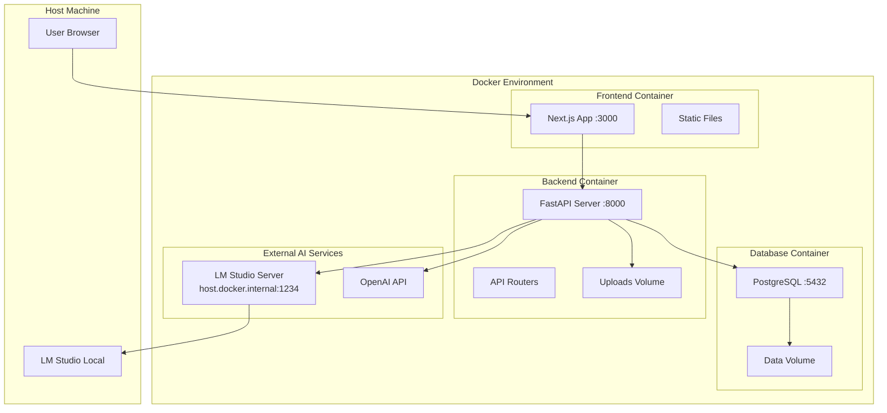

### 2. Kiến trúc Hệ thống Tổng thể

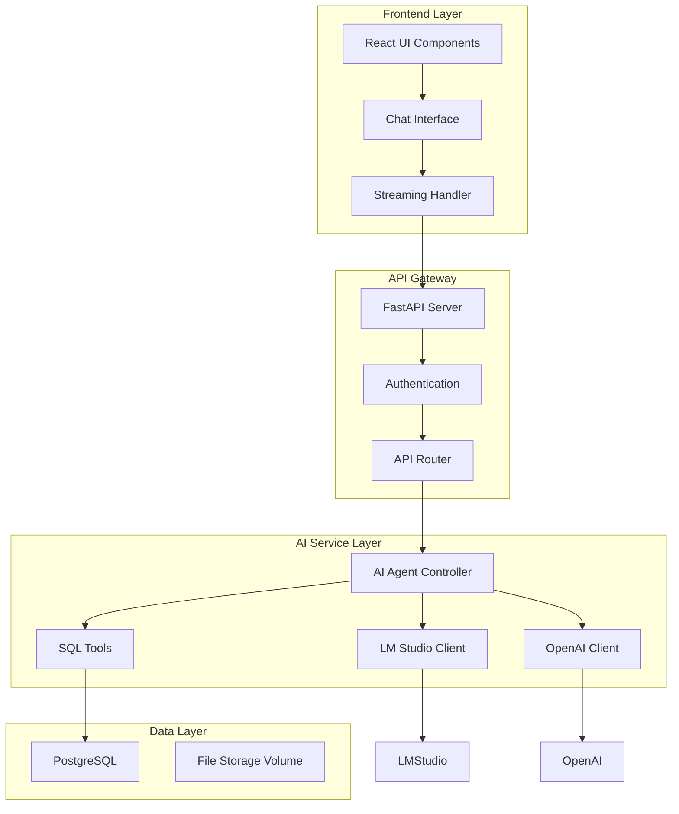

---

## 🔄 LUỒNG HOẠT ĐỘNG

### 1. Luồng Request-Response Chi tiết

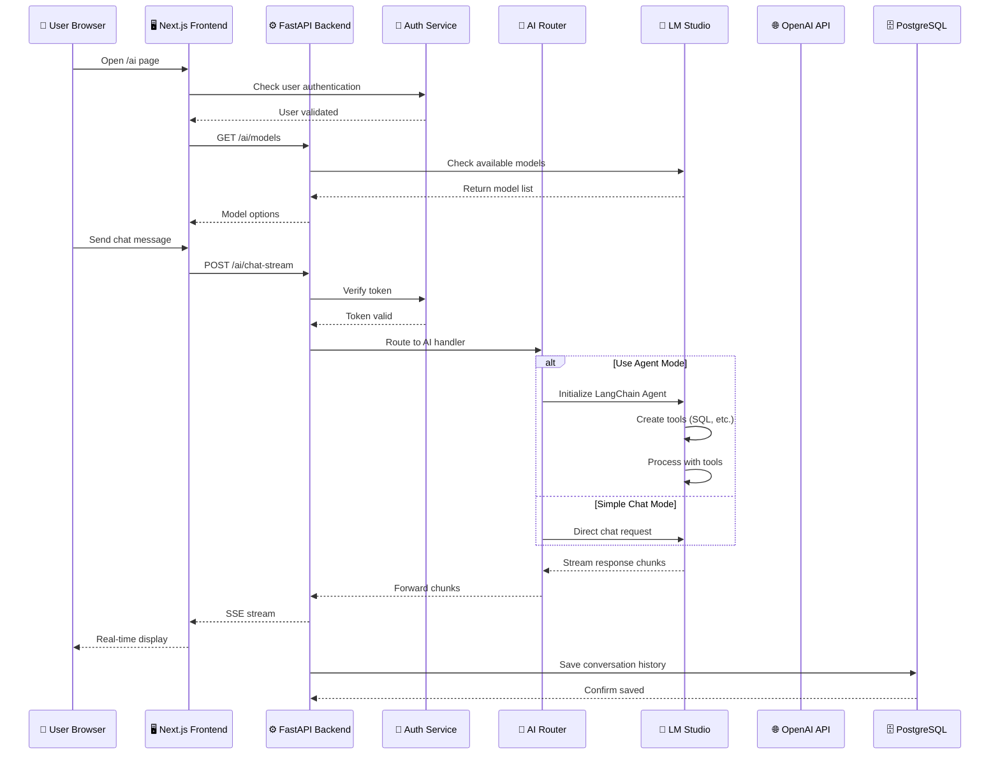

### 2. AI Service Flow Chi tiết

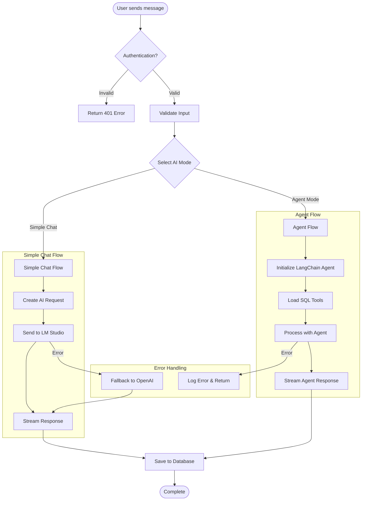

### 3. Streaming Response Flow

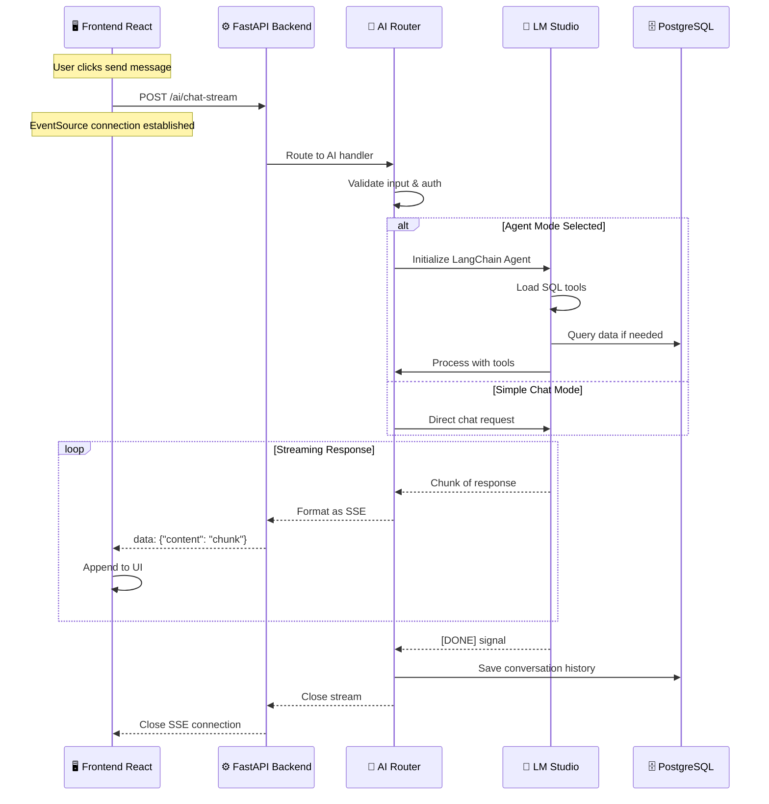

### 4. Frontend Chat Interface States

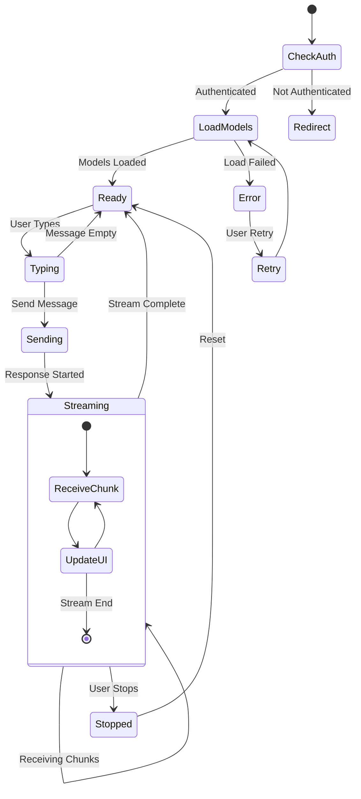

### 5. Frontend Chat Interface Features (Updated)

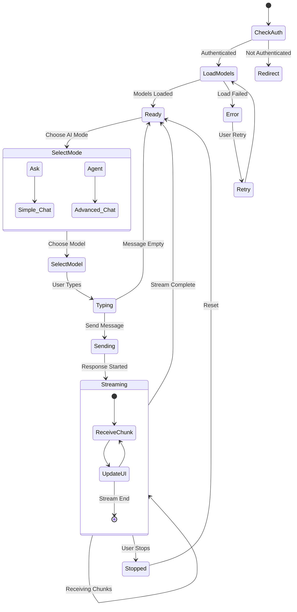

### 6. User Experience & Accessibility Features

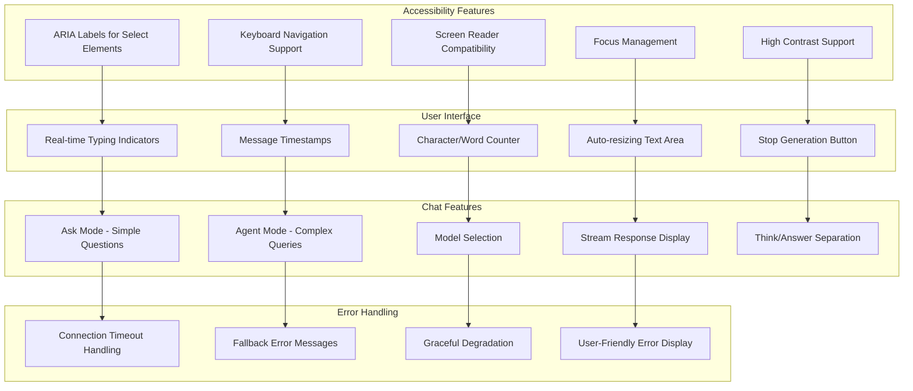

---

## 🚀 CẢI TIẾN ACCESSIBILITY & UX

### 1. Accessibility Improvements

#### A. Select Elements với ARIA Support
```typescript
// Mode Selection với accessibility labels
<select
  value={useAgent ? "agent" : "ask"}
  onChange={(e) => setUseAgent(e.target.value === "agent")}
  aria-label="Select AI mode"
  title="Choose between Ask mode for simple questions or Agent mode for complex queries"
  className="..."
>
  <option value="ask">Ask</option>
  <option value="agent">Agent</option>
</select>

// Model Selection với accessibility labels  
<select
  value={selectedModel}
  onChange={(e) => setSelectedModel(e.target.value)}
  aria-label="Select AI model"
  title="Choose which AI model to use for responses"
  className="..."
>
  {models.map((model, index) => (
    <option key={index} value={model}>
      {model.split('/').pop()}
    </option>
  ))}
</select>
```

#### B. Button Accessibility
```typescript
// Send Message Button với ARIA labels
<button
  onClick={handleSendMessage}
  disabled={!input.trim() || isTyping}
  aria-label="Send message"
  title="Send your message to the AI"
  className="..."
>
  <PaperAirplaneIcon className="h-5 w-5" />
</button>

// Stop Generation Button với ARIA labels
<button
  onClick={handleStopCompletion}
  title="Stop generating"
  aria-label="Stop generating"
  className="..."
>
  <StopIcon className="h-5 w-5" />
</button>
```

#### C. Animation với CSS Classes thay vì Inline Styles
```typescript
// Typing indicator với Tailwind CSS animation delays
<div className="flex items-center space-x-1">
  <div className="w-2 h-2 bg-gray-400 rounded-full animate-bounce [animation-delay:0ms]"></div>
  <div className="w-2 h-2 bg-gray-400 rounded-full animate-bounce [animation-delay:150ms]"></div>
  <div className="w-2 h-2 bg-gray-400 rounded-full animate-bounce [animation-delay:300ms]"></div>
</div>
```

### 2. User Experience Enhancements

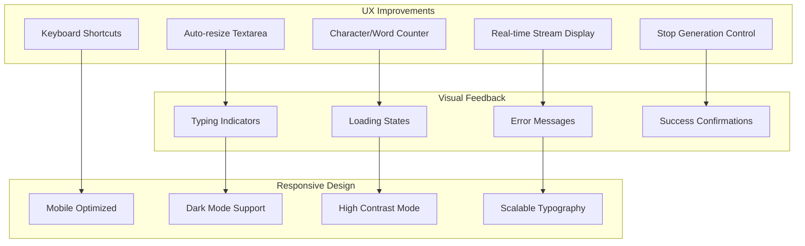

---

## 🛠️ API ENDPOINTS

### Cấu trúc API Endpoints

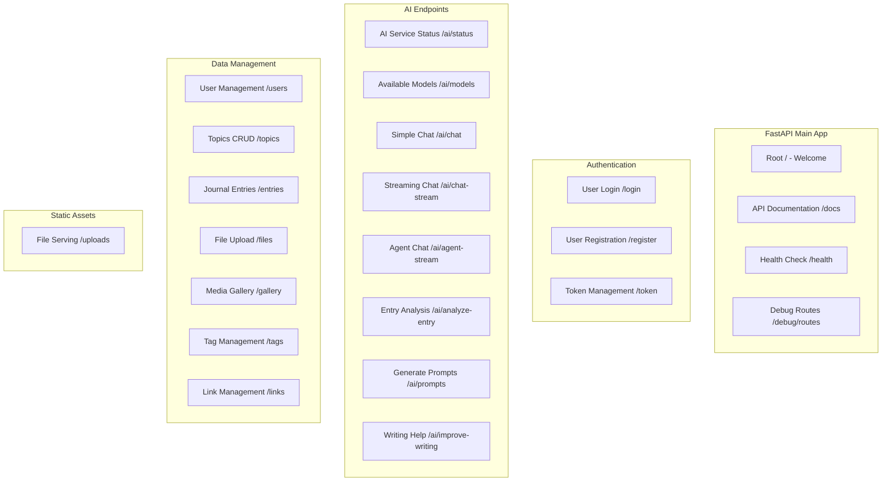

---

## 📊 PHÂN TÍCH NGHIỆP VỤ

### 1. Business Model Canvas

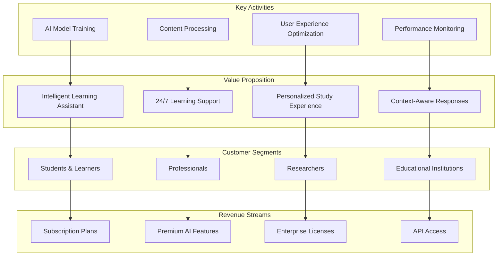

### 2. User Journey Mapping

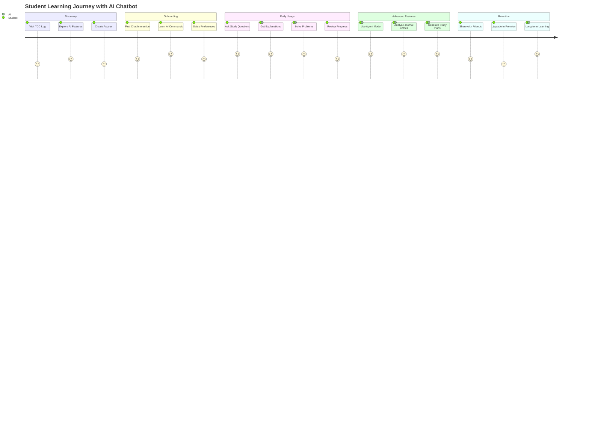

### 3. Use Cases & Scenarios

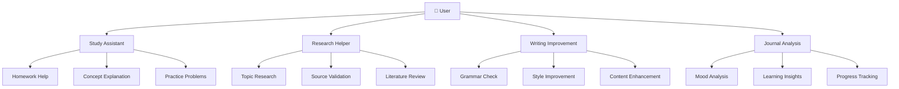

---

## 🔧 CẤU HÌNH THỰC TẾ

### Environment Variables (Backend)
```bash
DATABASE_URL=postgresql+psycopg2://postgres:password@db:5432/postgres
SECRET_KEY=hZKxcKs2I92_s90ZVQNw4MF3BI1qKFFI-2PwhK8OlRM
ACCESS_TOKEN_EXPIRE_MINUTES=60
RUN_MIGRATIONS=true
SEED_DATA=true
ADDITIONAL_CORS_ORIGINS=http://frontend:3000,http://localhost:3000
LM_STUDIO_BASE_URL=http://host.docker.internal:1234/v1
LM_STUDIO_MODEL=deepseek-r1-distill-qwen-1.5b
```

### Environment Variables (Frontend)
```bash
NEXT_PUBLIC_API_URL=http://localhost:8000
NEXT_SERVER_API_URL=http://backend:8000
```

### Docker Services Configuration
1. **Database**: PostgreSQL 14 với persistent volume
2. **Backend**: FastAPI với auto-migration và seed data
3. **Frontend**: Next.js với static file serving
4. **AI Service**: LM Studio external service qua host.docker.internal

---

## ⚡ TỐI ƯU HÓA & ERROR HANDLING

### 1. Error Handling và Fallback Flow

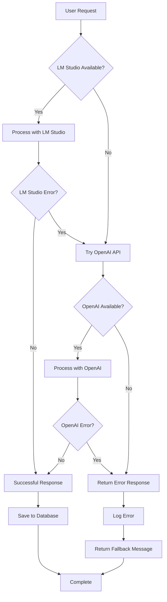

### 2. Performance Optimization
```python
# CORS Configuration
app.add_middleware(RequestLoggingMiddleware)  # Custom logging
app.add_middleware(CORSMiddleware, ...)       # CORS handling

# Streaming Implementation
async def stream_generator():
    for chunk in ai_response:
        yield f"data: {json.dumps(chunk)}\n\n"

# Global Exception Handler
@app.exception_handler(Exception)
async def global_exception_handler(request, exc):
    logger.exception(f"Unhandled exception: {str(exc)}")
    return JSONResponse(status_code=500, content={"detail": str(exc)})
```

---

## 📈 KPIs & METRICS

### Key Performance Indicators

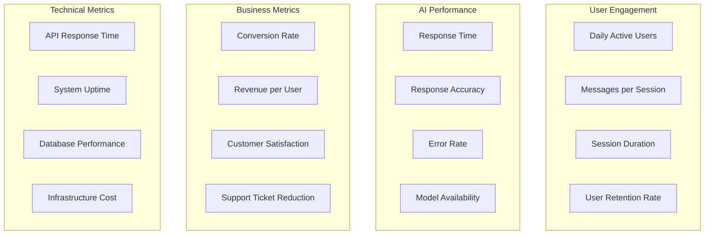

---

## 🔍 SO SÁNH & CẢI TIẾN

### Điểm Khác biệt với Tài liệu Cũ

#### ✅ Chính xác trong implementation hiện tại:
- Cấu trúc FastAPI với multiple routers
- Authentication flow với JWT tokens
- Database integration với SQLAlchemy
- Docker compose setup
- Agent mode với LangChain tools
- Real-time streaming với Server-Sent Events

#### ❌ Cần cập nhật trong tương lai:
1. **LM Studio Connection**: Sử dụng `host.docker.internal` (tạm thời)
2. **No Redis**: Hiện tại không có Redis cache layer
3. **Single Instance**: Chưa có load balancing hay clustering
4. **No Vector Database**: Chưa có PGVector implementation
5. **Basic Monitoring**: Chưa có comprehensive monitoring

---

## 📅 ROADMAP PHÁT TRIỂN

### Phase 1 (Hiện tại) ✅
- Basic chat functionality
- Streaming responses
- Agent mode với tools
- Authentication & authorization
- File upload và gallery management

### Phase 2 (Gần) 🔄
- Redis caching layer
- PGVector for semantic search
- Better error handling và monitoring
- Performance optimization
- Advanced AI features

### Phase 3 (Tương lai) 📅
- Load balancing và clustering
- Multi-region deployment
- Enterprise features
- Advanced analytics
- Custom model training

---

## 🎯 KẾT LUẬN

AI Chatbot trong TCC Log đã được implement với kiến trúc vững chắc và luồng hoạt động rõ ràng. Hệ thống hiện tại hỗ trợ:

- **Real-time streaming chat** với LM Studio và OpenAI fallback
- **Agent mode** với LangChain tools để query database
- **Authentication & authorization** đầy đủ
- **Error handling** và fallback mechanisms
- **Docker deployment** với persistent data

Tài liệu này cung cấp cái nhìn toàn diện về chức năng AI Chatbot từ góc độ kỹ thuật, nghiệp vụ và vận hành, phù hợp cho việc review stakeholder và implementation planning.

---

**Last Updated**: June 25, 2025  
**Version**: 1.0 - Comprehensive Documentation
